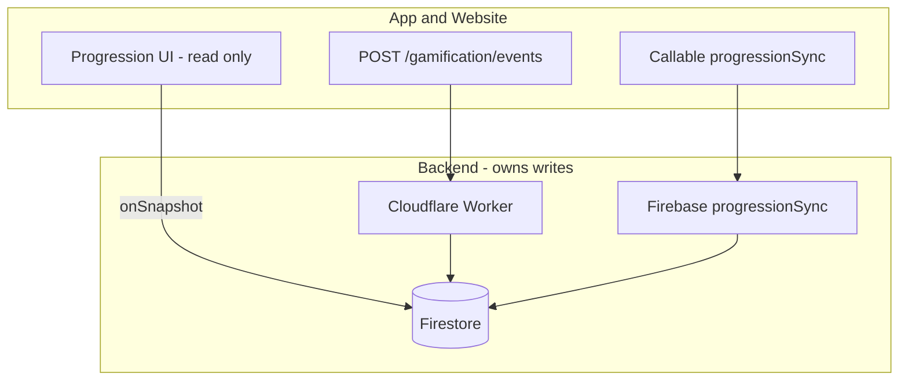

# Progression View — App & Website Parity

This document describes how the **Progression** experience works in the Flutter app (`CreatorProgressionPanel` on the Home **Progression** tab) and what the **website must implement** to stay in sync.

**Core rule:** Clients **display** progression data from Firestore. They **do not** calculate level, rank, or mission XP locally. All writes go through **trusted backend** paths.

Related docs:

- `docs/GAMIFICATION_ALIGNMENT.md` — global gamification principles
- `docs/gamification-web.md` — HTTP event API (`POST /gamification/events`)
- `lib/features/gamification/firestore_user_shape.md` — Firestore field aliases

---

## 1. What “Progression View” is in the app

| Item | Value |
|------|--------|
| UI widget | `lib/features/gamification/widgets/creator_progression_panel.dart` |
| Location | Home feed → **Progression** tab (`FeedTab.progression` → route `home/progression`) |
| Primary read provider | `userProgressBundleProvider` → `GamificationRepository.watchProgressBundle` |
| Onboarding tasks | `ProgressionService` + Firebase callable `progressionSync` |

The screen combines **two server-driven systems** that must both work on web:

1. **Gamification layer** — XP, level, rank, daily missions (Worker events + Firestore state)
2. **Onboarding progression tasks** — seven “first things to do” milestones (`progressionSync` callable)

---

## 2. Architecture overview



| Action | App | Website must |
|--------|-----|----------------|
| Show level / XP / rank | Listen to Firestore | **Same listeners** |
| Show daily missions | Read `dailyMissions` / `missions` | **Same** |
| Show onboarding checklist | Read `progressionSummary` + `users/…/progression/*` | **Same** |
| Award mission XP | `createGamificationEvent()` after real action | **Same HTTP contract** |
| Sync onboarding tasks | `progressionSync` on refresh / after actions | **Same callable** |
| Write XP directly on `users/{uid}` | **Never** | **Never** |

---

## 3. Firestore — what the UI reads

### 3.1 Preferred: `users/{uid}/gamification/state`

Canonical gamification snapshot (merged over legacy fields in `GamificationMapper`).

```json
{
  "uid": "firebaseUid",
  "xp": 1240,
  "level": 7,
  "rank": "Rising Creator",
  "currentLevelXp": 1000,
  "nextLevelXp": 1500,
  "progressPercent": 48,
  "streakCount": 5,
  "consistencyScore": 78,
  "badges": [],
  "completedMissions": {},
  "activeMissions": [],
  "showLevelUpModal": false,
  "updatedAt": "<timestamp>"
}
```

**Website:** `onSnapshot(users/{uid}/gamification/state)` plus `onSnapshot(users/{uid})` for legacy merge (same as `GamificationRepository`).

### 3.2 Legacy / merged on `users/{uid}`

Still used during migration; app accepts **camelCase and snake_case** aliases.

| Area | Fields |
|------|--------|
| Summary | `gamification.level`, `gamification.totalXp`, `gamification.rankTitle`, `gamification.streakDays`, `gamification.creatorScore`, `gamification.nextAction` |
| Onboarding rollup | `progressionSummary.totalXP`, `progressionSummary.rankTitle`, `progressionSummary.completedTaskIds`, `progressionSummary.creatorScore`, `progressionSummary.streakStatus` |
| Missions | `dailyMissions[]`, `missions[]` (see `DailyMissionModel` in app) |
| Subscription (tier gates) | `subscription`, `entitlements`, `usage` |

### 3.3 Onboarding task docs: `users/{uid}/progression/{taskId}`

One doc per task (see §5). Example:

```json
{
  "taskId": "firstPostCreated",
  "completed": true,
  "xpReward": 50,
  "completedAt": "<timestamp>",
  "source": "videos",
  "checkedAt": "<timestamp>"
}
```

### 3.4 Audit / idempotency (read optional, write server-only)

| Path | Purpose |
|------|---------|
| `gamification_events/{eventId}` | Trusted event receipt |
| `users/{uid}/gamification_audit/{eventId}` | XP applied audit |

---

## 4. Backend write paths (website must use these)

### 4.1 Trusted gamification events (XP + daily missions)

**Preferred:** Cloudflare Worker

```http
POST https://<worker-origin>/gamification/events
Authorization: Bearer <Firebase_ID_token>
Content-Type: application/json
```

**Body:**

```json
{
  "eventId": "<uuid-v4>",
  "uid": "<must match token>",
  "type": "content.published",
  "source": "web",
  "entityType": "video",
  "entityId": "videoDocId",
  "metadata": { "platform": "streamerstip" }
}
```

- **When to call:** Only after the underlying action succeeds (publish, comment, follow, etc.).
- **Idempotency:** Reuse the same `eventId` on retry; server returns `200` without double XP.
- **Constants:** Same strings as `lib/features/gamification/gamification_event_types.dart`.

**Optional fallback:** Firebase HTTPS `gamificationEvents` (full function URL, no extra path). See `docs/gamification-web.md`.

**App entry point:** `createGamificationEvent()` → `GamificationEventService.emitTrustedEvent()`.

### 4.2 Onboarding progression sync (`progressionSync`)

**Firebase callable (v2):** `progressionSync`  
**Region:** `us-central1`  
**Auth:** Required (uses `request.auth.uid`)

#### Action: `refresh` (default)

Syncs all seven onboarding tasks from **account evidence** in Firestore, recalculates summary, syncs `gamification/state`.

**Request:**

```json
{ "action": "refresh" }
```

**Response (shape):**

```json
{
  "ok": true,
  "action": "refresh",
  "progress": {
    "totalXP": 350,
    "level": 4,
    "rankName": "Consistent Creator",
    "rankTitle": "Consistent Creator",
    "creatorScore": 72,
    "streakCount": 1,
    "completedTaskIds": ["profileCompleted", "firstPostCreated"],
    "completedTaskCount": 2,
    "completed": ["profileCompleted", "firstPostCreated"]
  }
}
```

**Website:**

```javascript
import { getFunctions, httpsCallable } from 'firebase/functions';

const progressionSync = httpsCallable(
  getFunctions(undefined, 'us-central1'),
  'progressionSync',
);

await progressionSync({ action: 'refresh' });
```

**App:** `ProgressionService.refreshUserProgress(uid)` on pull-to-refresh / tab open.

#### Action: `completeTask`

Marks a single onboarding task when the client knows it completed (server still validates evidence on refresh).

**Request:**

```json
{
  "action": "completeTask",
  "taskId": "firstPostCreated",
  "source": "videos"
}
```

**App:** `ProgressionService.completeTask(uid, taskId)` with optimistic UI; rolls back if server returns `reason: 'evidence_not_found'`.

---

## 5. Onboarding task catalog (must match exactly)

Defined in **both**:

- `lib/services/progression_service.dart` (`ProgressionTaskIds`)
- `cloud_functions/src/gamification/progression_callable.js` (`TASKS`)

| `taskId` | Title (app UI) | XP | Evidence source |
|----------|----------------|-----|-----------------|
| `profileCompleted` | Complete your profile setup | 50 | `users/{uid}` avatar, displayName, username, bio |
| `firstPostCreated` | Upload your first post | 50 | `videos` where `userId` / `creatorId`, or `users/{uid}/videos` |
| `firstConnectionMade` | Make your first connection | 50 | follows / following collections |
| `firstCommentMade` | Leave your first comment | 50 | comments (collection group) |
| `firstBookmarkSaved` | Save your first post | 50 | bookmarks / favorites |
| `firstLikeGiven` | Like your first post | 50 | likes / `liked_videos` |
| `firstMessageSent` | Send your first message | 50 | messages / shared drafts |

**Website:** After each action, call `progressionSync({ action: 'refresh' })` or `completeTask` with the matching `taskId`. Do not invent new task IDs without updating both codepaths.

---

## 6. Level & rank table (single source of truth)

**Do not** implement level curves on web or app.

Canonical table: `cloud_functions/src/gamification/level_table.js`

Examples:

| Level | Rank title | XP required |
|-------|------------|-------------|
| 1 | New Creator | 0 |
| 2 | Getting Started | 100 |
| 3 | Clip Builder | 250 |
| 4 | Consistent Creator | 500 |
| 5 | Rising Creator | 900 |
| 10 | Growth Creator | 2500 |
| 50 | StreamersTip Legend | 60000 |

`progressionSync` and Worker gamification both call `levelRowForTotalXp(totalXp)`.

---

## 7. When to emit events vs call progressionSync

| User action | Gamification event `type` | progressionSync |
|-------------|---------------------------|-----------------|
| Publish video | `content.published` (or `content.video_uploaded`) | `completeTask` / `refresh` → `firstPostCreated` |
| Complete profile | `profile.completed` | `profileCompleted` |
| First comment | `engagement.comment_created` | `firstCommentMade` |
| First bookmark | `engagement.bookmark_created` | `firstBookmarkSaved` |
| First like | `engagement.like_given` | `firstLikeGiven` |
| First follow/connection | `engagement.follow_created` or `engagement.connection_created` | `firstConnectionMade` |
| First message | `community.message_sent` | `firstMessageSent` |
| Qualifying day (watch / social / publish) | `activity.day_qualified` (once per day, deduped `day_{uid}_{yyyyMMdd}`) | — |
| Open Progression tab | — | `{ action: 'refresh' }` |

**App examples (implemented):**

- Publish: `scheduleGamificationEvent(content.published)` + `DailyActivityService.maybeEmitDayQualified`
- Like / comment / follow / bookmark: `scheduleEngagementGamificationEvent` (`engagement.*`) + `progressionSync` first-time task
- Chat message: `community.message_sent` via `chat_service_optimized.dart`
- Home session (≥30s or ≥2 videos): `activity.day_qualified` on session end
- Level-up modal dismiss: `progressionSync` `{ action: 'dismissLevelUpModal' }`

---

## 8. Progression UI sections (parity checklist)

Build the website Progression page with the same **data sources**, not duplicated logic.

| Section | App data source | Website implementation |
|---------|-----------------|------------------------|
| Level + XP bar | `UserProgressBundle.progress` (`GamificationSummaryModel`) | Listen `gamification/state` + merge legacy `gamification` |
| Rank title | `progress.rankTitle` | `rank` / `rankTitle` from state |
| Streak | `progress.streakDays`, `progressionSummary.streakStatus` | Same fields |
| Creator score | `progress.creatorScore` | Same |
| Daily / weekly missions | `bundle.missions` (`dailyMissions` / `missions`) | Read arrays; claim via Worker `POST …/gamification/missions/claim` if exposed |
| “Onboarding progress” card | `ProgressionService.listenToProgress` → 7 tasks | Same task IDs + `progressionSummary.completedTaskIds` |
| Subscription tier badges | `bundle.subscription` | Read `subscription` on user doc |
| Level-up modal | `gamification/state.showLevelUpModal` | App: `GamificationCelebrationOverlay`; clear via `dismissLevelUpModal` |

**Empty missions:** App may show **template placeholders** until the server materializes mission rows. Real progress requires Worker/CF writes.

---

## 9. Real-time sync

**App**

- `userProgressBundleProvider` → dual listener on `users/{uid}` + `users/{uid}/gamification/state`
- `ProgressionService.listenToProgress(uid)` → `users/{uid}/progression/*` + `progressionSummary` on user doc

**Website**

```javascript
// Gamification summary + missions
onSnapshot(doc(db, 'users', uid, 'gamification', 'state'), …);
onSnapshot(doc(db, 'users', uid), …); // legacy merge

// Onboarding tasks
onSnapshot(collection(db, 'users', uid, 'progression'), …);
```

Any write from app or web appears on the other client within listener latency.

---

## 10. Security rules (clients)

| Path | Client write |
|------|----------------|
| `users/{uid}/gamification/*` | **Read only** (owner) |
| `gamification_events/{eventId}` | Create with `uid == auth.uid` (if allowed); prefer HTTP Worker |
| `users/{uid}.gamification` / XP fields | **No direct client XP writes** |
| `users/{uid}/progression/{taskId}` | **Server only** via `progressionSync` Admin SDK |

---

## 11. Environment & deploy

| Piece | App config | Website |
|-------|------------|---------|
| Worker gamification URL | `lib/features/gamification/gamification_backend_config.dart` or `--dart-define=GAMIFICATION_EVENTS_BASE_URL` | Same Worker origin |
| Firebase project | `streamerstip-6cfdb` (prod) | Same project |
| Callable region | `us-central1` | `getFunctions(app, 'us-central1')` |
| CORS | Worker `ALLOWED_ORIGINS` | Add staging origin if needed |

Deploy:

```bash
cd cloudflare_workers/mux && npx wrangler deploy
firebase deploy --only functions:progressionSync,functions:gamificationEvents
```

---

## 12. Production parity tests

Run on **both** app and website after each change:

1. **Publish** on web → `content.published` event → XP increases on app Progression tab within seconds.
2. **Publish** on app → same visible on web.
3. **Complete profile** on web → `profile.completed` + `profileCompleted` task → checklist updates on app.
4. **Progression tab open** → `progressionSync` refresh → onboarding counts match Firestore `progression` subcollection.
5. **Duplicate event** (same `eventId`) → still `200`, no double XP in `gamification.totalXp`.
6. **Level-up** → same `level` and `rank` on app and web (from `gamification/state`, not local math).
7. **Sign out / other user** → no progression data leak (owner-only reads).

---

## 13. Code map (this repo)

| Concern | Path |
|---------|------|
| Progression UI | `lib/features/gamification/widgets/creator_progression_panel.dart` |
| Read bundle | `lib/features/gamification/data/gamification_repository.dart` |
| Firestore → UI model | `lib/features/gamification/gamification_mapper.dart` |
| Emit events | `lib/features/gamification/create_gamification_event.dart` |
| Event types | `lib/features/gamification/gamification_event_types.dart` |
| HTTP client | `lib/features/gamification/services/gamification_event_service.dart` |
| Onboarding service | `lib/services/progression_service.dart` |
| Onboarding callable | `cloud_functions/src/gamification/progression_callable.js` |
| Level table | `cloud_functions/src/gamification/level_table.js` |
| State sync | `cloud_functions/src/gamification/gamification_state.js` |
| Worker events | `cloudflare_workers/mux/src/index.js` (`handleGamificationEvent`) |
| Web HTTP guide | `docs/gamification-web.md` |
| Alignment principles | `docs/GAMIFICATION_ALIGNMENT.md` |

---

*Progression View parity = read the same Firestore paths, write only through Worker events + `progressionSync`, never compute rank locally.*
