# StreamersTip App Screen Design Map

StreamersTip mobile app — design review packet

Routing: named routes via AppRoutes.
Main shell: 5-tab IndexedStack — Home | Network | Create(+) | Inbox | Profile
Floating liquid-glass bottom dock on main tabs.
Immersive screens (chat, publish, academy, edit/share) hide the dock.
Brand: dark navy + purple accent + purple→blue gradients.
Patterns: full-bleed video feed, flip profile/streamer card, Tippy AI, Academy gamification.

12 live screenshots included.
Not yet photographed: Auth, Tippy onboarding, Home feed, Camera, Discover, Player, Menu, Settings, Tippy chat, Upgrade, Manage Posts, Planner, Bookmarks, Admin.

## Screens

### Streamer Academy (Home)

- Group: Academy
- Route: `/academy`
- Purpose: Learning hub for creator skills with gamification.

**UI / features**

- App bar: back, title, bookmark, insights
- Hero: Level / XP / streak / weekly goal + progress
- Search guides
- Learning Paths
- Daily & Weekly Quests with XP

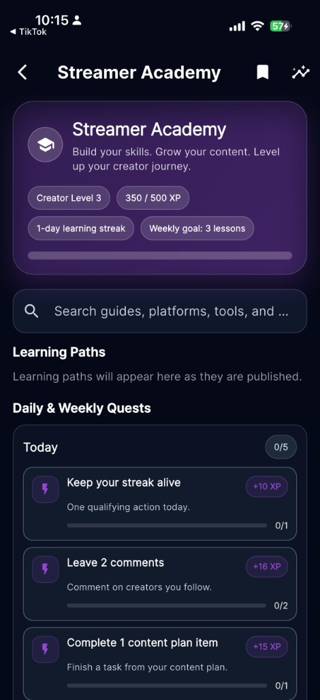

### Academy Category — Beginner

- Group: Academy
- Route: `/academy/category`
- Purpose: Category directory of Streamer Academy guides.

**UI / features**

- Academy Category title
- Beginner header + copy
- Guide cards with book thumb, labels, duration pills

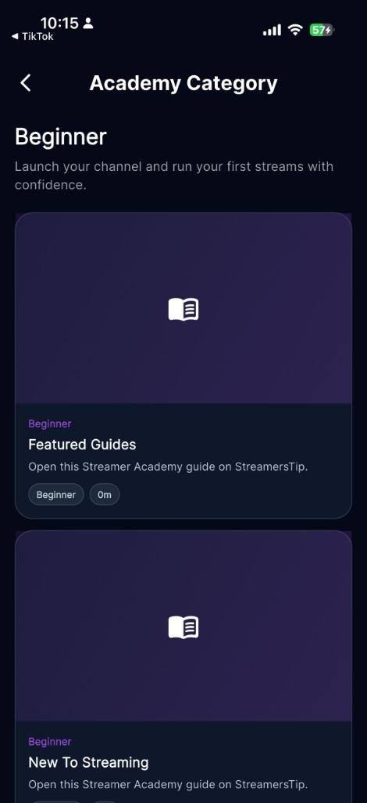

### Activity

- Group: Content
- Route: `/activity`
- Purpose: Creator pulse / notifications feed.

**UI / features**

- Your creator pulse subtitle
- Filter pills (All active)
- Date-grouped planner + social cards
- Follow CTA

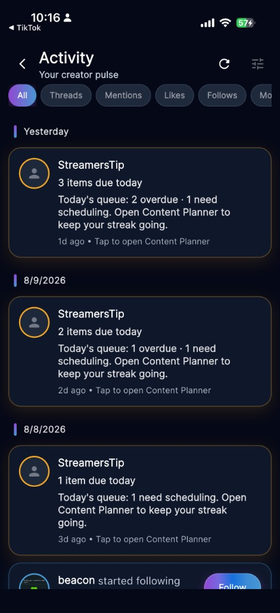

### Your Network

- Group: Main Tabs
- Route: `/network`
- Purpose: Manage creator circle: connections, followers, following.

**UI / features**

- Header + search/filter/refresh
- Status chips
- Connections/Followers/Following cards
- Connection list + message action
- Floating glass dock

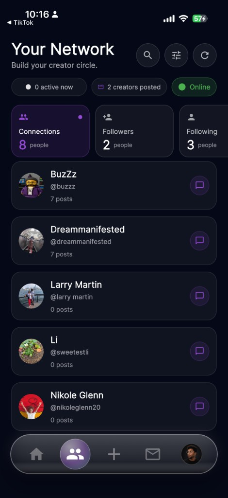

### Messages (Inbox)

- Group: Main Tabs
- Route: `tab Inbox`
- Purpose: DM conversation list.

**UI / features**

- Messages + New
- Search
- Chat rows
- Dock with Inbox active

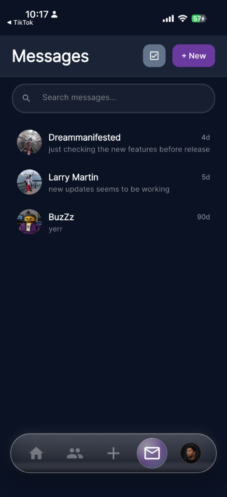

### Chat Thread

- Group: Content
- Route: `/chat`
- Purpose: 1:1 messaging thread.

**UI / features**

- Header with OFFLINE status
- Gradient outgoing bubbles
- GIF + reactions
- Composer

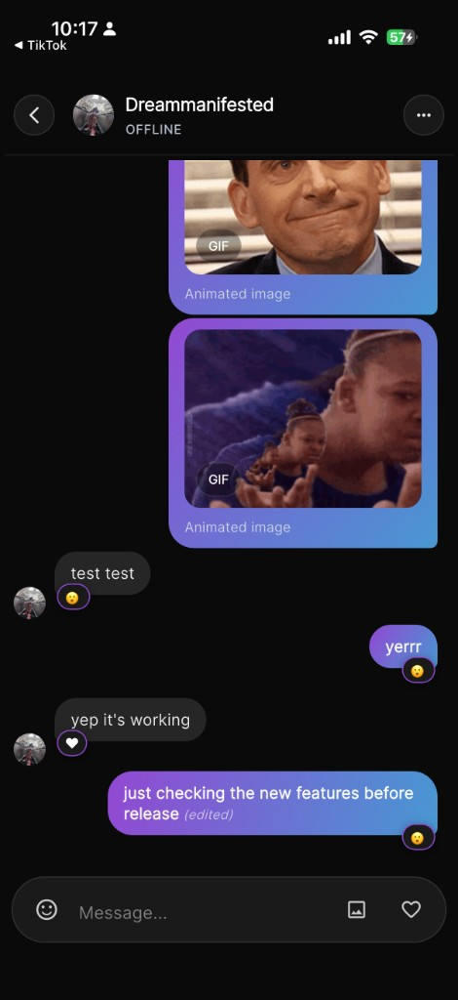

### New Post (Publish)

- Group: Content
- Route: `/camera/publish`
- Purpose: Compose and publish a video post.

**UI / features**

- Preview + Ready to post
- Letterbox warning
- Caption + Tippy improve/hashtags
- Quick hashtags
- Publish Now CTA

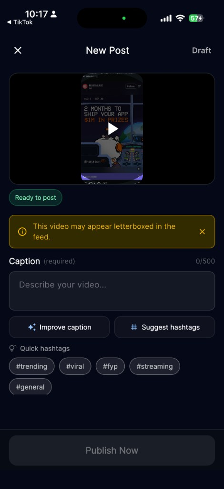

### Edit Profile

- Group: Profile
- Route: `/edit_profile`
- Purpose: Edit identity fields and Streamer Card preferences.

**UI / features**

- Admin badge
- Avatar edit
- About rows
- Show Favorites toggle

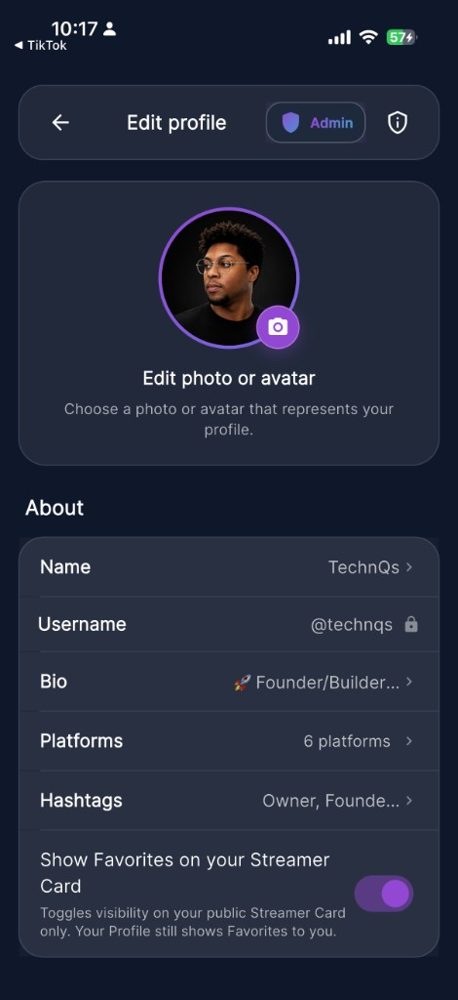

### Share Profile

- Group: Profile
- Route: `/share_profile`
- Purpose: Share profile via QR or link.

**UI / features**

- QR card
- Copy link
- Share link gradient CTA

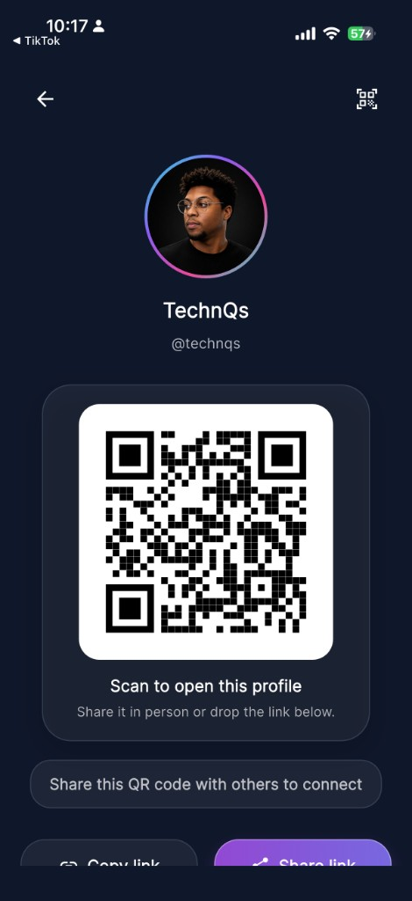

### Profile Details (Back)

- Group: Profile
- Route: `Profile flip`
- Purpose: Profile flip-back: bio and platforms.

**UI / features**

- Score badge
- Hashtag pills
- Bio accordion
- Platforms list
- Dock

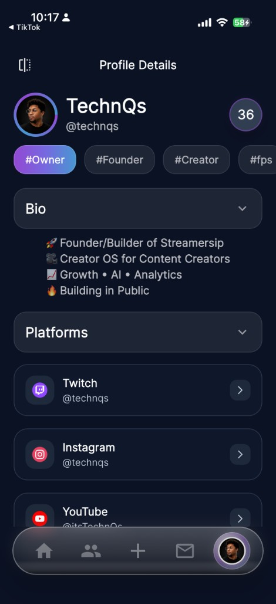

### Creator Score

- Group: Profile
- Route: `overlay on Profile`
- Purpose: Creator health score breakdown.

**UI / features**

- 36/100 Growing Creator Level 3
- Consistency/Content/Networking/Engagement bars
- How to improve checklist

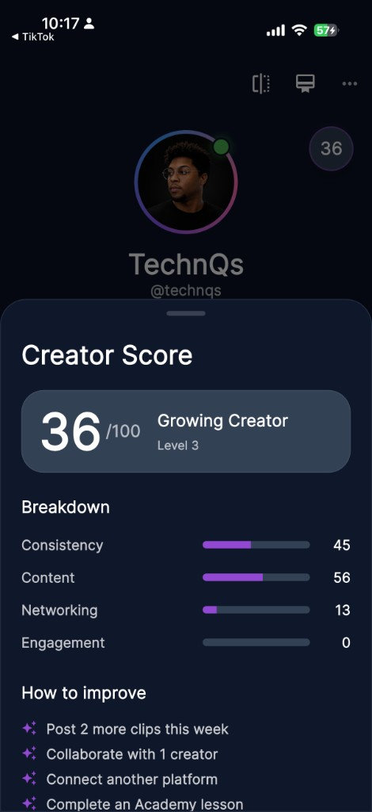

### Streamer Details

- Group: Profile
- Route: `/streamer_card`
- Purpose: Streamer card details with score + bio + platforms.

**UI / features**

- Score breakdown
- Bio
- Platforms

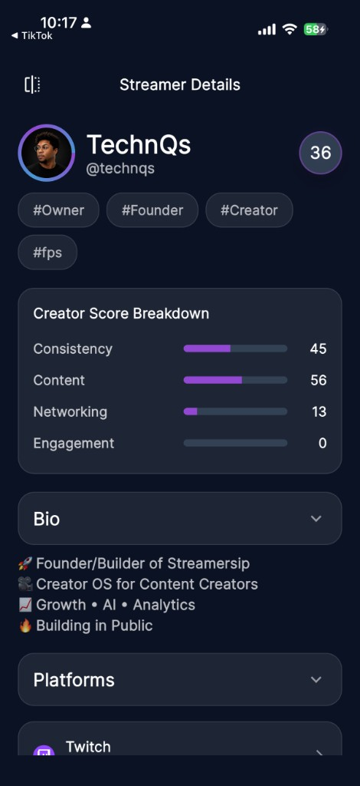
